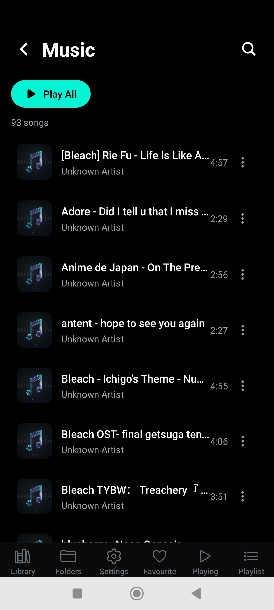

# Flowbit - Music Player App 🎵

A modern, feature-rich music player application built with React Native and Expo. Flowbit offers a seamless music listening experience with an intuitive interface, powerful playback controls, and comprehensive music management features.

## 📱 App Preview



## ✨ Features

### Core Playback

- **Audio Playback**: High-quality music playback with support for various audio formats
- **Background Playback**: Continue listening even when the app is in the background
- **Playback Controls**: Play, pause, skip, seek, and shuffle functionality
- **Progress Tracking**: Real-time progress bar with waveform visualization
- **Volume Control**: Precise volume adjustment with smooth transitions

### Music Management

- **Library View**: Browse your entire music collection with sorting options
- **Folder Navigation**: Access music organized by folders
- **Playlist Management**: Create, edit, and manage custom playlists
- **Favorites**: Mark and quickly access your favorite tracks
- **Recently Played**: Track your listening history

### User Interface

- **Dark Theme**: Modern dark theme with cyan accent colors
- **Tab Navigation**: Intuitive bottom tab navigation for easy access
- **Mini Player**: Compact mini-player for quick controls while browsing
- **Haptic Feedback**: Tactile feedback for enhanced user experience
- **Responsive Design**: Optimized for various screen sizes and orientations

### Advanced Features

- **Equalizer**: Customizable EQ settings for personalized audio
- **Song Actions**: Context menu with various song operations
- **Search**: Quick search through your music library
- **Settings**: Comprehensive settings for customizing the app experience

## 🛠 Tech Stack

### Core Technologies

- **React Native**: Cross-platform mobile app development
- **Expo**: Development platform and toolchain
- **TypeScript**: Type-safe JavaScript development
- **Expo Router**: File-based routing system

### Key Libraries

- **Audio**: `expo-audio`, `react-native-audio-pro`
- **Navigation**: `@react-navigation/native`, `expo-router`
- **UI Components**: `react-native-paper`, `@expo/vector-icons`
- **State Management**: `zustand`
- **Media**: `expo-media-library`, `expo-image-picker`
- **Animations**: `react-native-reanimated`, `react-native-worklets`
- **Storage**: `@react-native-async-storage/async-storage`
- **UI Enhancement**: `expo-linear-gradient`, `expo-blur`, `expo-haptics`

## 📱 Platform Support

- **iOS**: Full support with background audio capabilities
- **Android**: Complete support with required permissions for media access
- **Web**: Static web build available

## 🚀 Getting Started

### Prerequisites

- Node.js (v18 or higher)
- npm or yarn
- Expo Go app (for testing) or Android/iOS emulator

### Installation

1. **Clone the repository**

   ```bash
   git clone <repository-url>
   cd music-player
   ```

2. **Install dependencies**

   ```bash
   npm install
   ```

3. **Start the development server**

   ```bash
   npx expo start
   ```

### Running the App

Choose one of the following options from the terminal output:

- **Development Build**: Open in a custom development build
- **Android Emulator**: Launch in Android Studio emulator
- **iOS Simulator**: Launch in iOS Simulator
- **Expo Go**: Scan QR code with Expo Go app

## 📁 Project Structure

```
music-player/
├── app/                    # App screens and routing
│   ├── (tabs)/            # Tab-based navigation screens
│   │   ├── index/         # Library screen
│   │   ├── folders/       # Folder navigation
│   │   ├── playlist/      # Playlist management
│   │   ├── settings/      # App settings
│   │   ├── favourite/     # Favorite tracks
│   │   └── playing/       # Now playing screen
│   ├── _layout.tsx        # Root layout
│   └── modal.tsx          # Modal components
├── components/            # Reusable UI components
│   ├── screens/           # Screen-specific components
│   ├── ui/                # Basic UI components
│   ├── SongList.tsx       # Song list component
│   ├── MiniPlayer.tsx     # Mini player component
│   └── ...                # Other components
├── constants/             # App constants and themes
├── hooks/                 # Custom React hooks
├── types/                 # TypeScript type definitions
├── utils/                 # Utility functions
└── assets/                # Static assets (images, fonts)
```

## 🎨 Design System

### Color Scheme

- **Primary**: Dark background (#0A0A0A)
- **Secondary**: Light dark (#1A1A1A)
- **Accent**: Cyan (#00D9FF)
- **Text**: White and gray variations

### Typography

- Clean, modern typography optimized for mobile readability
- Consistent font weights and sizes throughout the app

## ⚙️ Configuration

### Android Permissions

The app requires the following Android permissions:

- `READ_MEDIA_AUDIO`: Access audio files
- `READ_MEDIA_IMAGES`: Access album artwork
- `READ_EXTERNAL_STORAGE`: Read external storage
- `RECORD_AUDIO`: Audio recording capabilities
- `MODIFY_AUDIO_SETTINGS`: Audio settings modification
- `FOREGROUND_SERVICE_MEDIA_PLAYBACK`: Background playback

### iOS Configuration

- Background audio mode enabled
- Tablet support included
- Adaptive icons provided

## 🔧 Development

### Available Scripts

- `npm start` - Start development server
- `npm run android` - Run on Android device/emulator
- `npm run ios` - Run on iOS device/simulator
- `npm run web` - Run in web browser
- `npm run lint` - Run ESLint

### Environment Variables

- `EXPO_PUBLIC_*` variables for public configuration
- EAS project ID configured for deployment

## 📦 Build & Deployment

### EAS Build

The project is configured with EAS (Expo Application Services) for building and deployment:

- Project ID: `4514ea6e-d95b-4481-ace3-a08edccc55f6`
- Build configuration in `eas.json`

### Build Requirements

- Android: Min SDK 26, Target SDK 35
- iOS: Latest iOS SDK
- Web: Static output configuration

## 🤝 Contributing

1. Fork the repository
2. Create a feature branch (`git checkout -b feature/amazing-feature`)
3. Commit your changes (`git commit -m 'Add some amazing feature'`)
4. Push to the branch (`git push origin feature/amazing-feature`)
5. Open a Pull Request

## 📄 License

This project is licensed under the MIT License - see the LICENSE file for details.

## 🙏 Acknowledgments

- [Expo](https://expo.dev) for the amazing development platform
- [React Native](https://reactnative.dev) for the cross-platform framework
- The open-source community for the incredible libraries and tools

## 📞 Support

For support and questions:

- Create an issue on GitHub
- Join our Discord community
- Check the [Expo documentation](https://docs.expo.dev)

---

**Flowbit** - Your music, your way. 🎧
